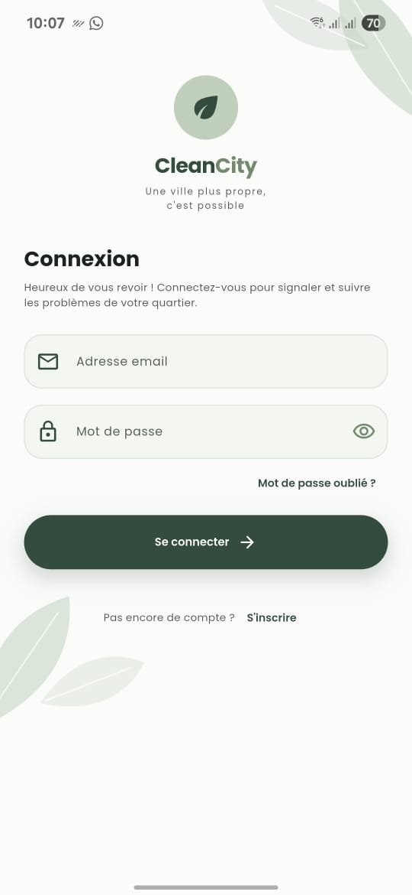
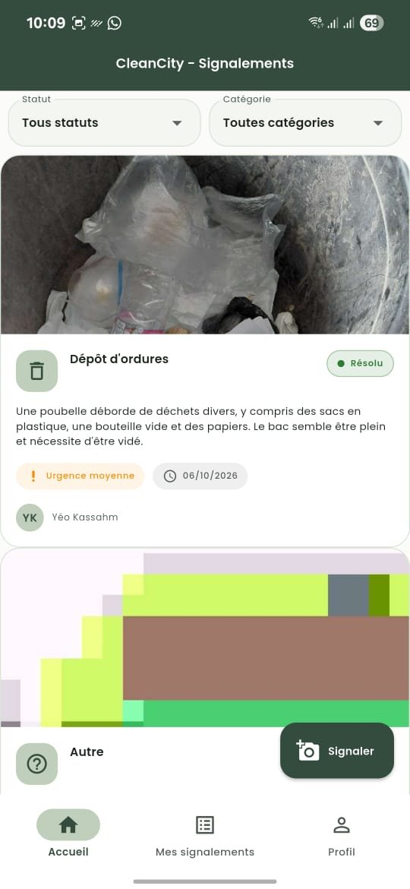
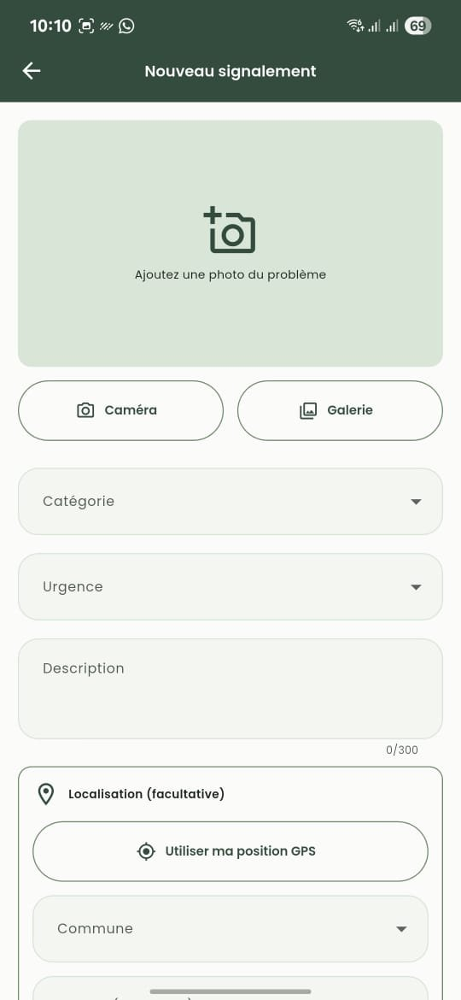
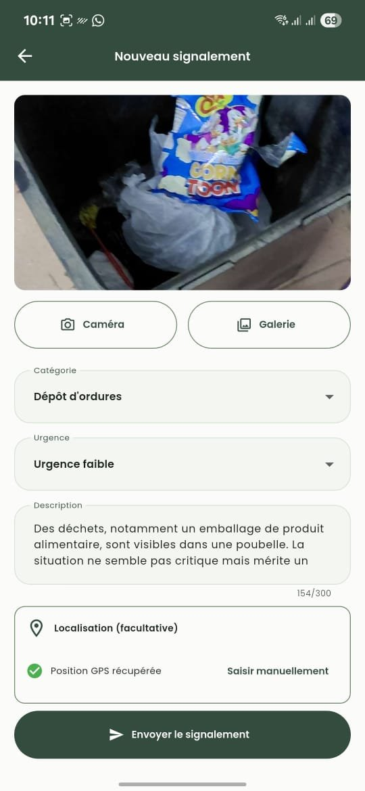
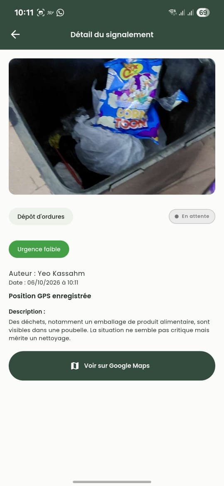
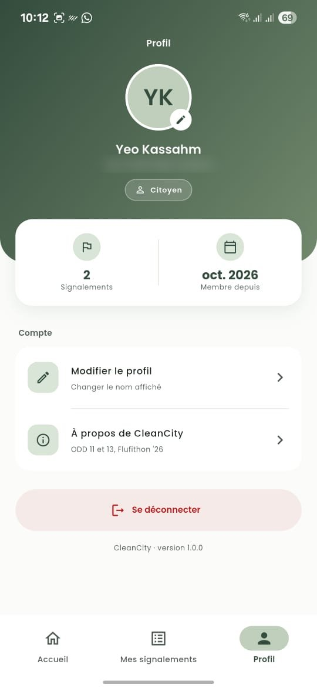

# CleanCity 🌿

**Une ville plus propre, c'est possible.**

CleanCity est une application mobile qui permet aux habitants d'Abidjan de signaler en quelques secondes les dépôts d'ordures sauvages et les caniveaux bouchés, avec une photo et leur position GPS. Une intelligence artificielle analyse la photo pour identifier le problème et estimer son urgence. Chaque signalement est visible par tous et suivi jusqu'à sa résolution.

Projet réalisé pour le **Flufithon '26**, hackathon final du **FlutterFire Summer Camp 2026**.

---

## Le problème

À Abidjan, les dépôts d'ordures sauvages et les caniveaux bouchés dégradent le cadre de vie et aggravent les inondations pendant la saison des pluies. Les citoyens qui constatent ces problèmes n'ont pas d'outil simple pour les signaler, ni pour savoir s'ils sont pris en charge.

## Notre solution

1. Le citoyen **prend une photo** du problème.
2. Une **IA analyse la photo** et propose la catégorie, le niveau d'urgence et une description, que le citoyen peut corriger.
3. L'application enregistre la **position GPS**, ou la commune et un point de repère si le GPS n'est pas disponible.
4. Le signalement apparaît **en temps réel** pour tous les utilisateurs.
5. Un **administrateur** fait évoluer son statut : en attente → en cours → résolu.

## Objectifs de Développement Durable

| ODD | Contribution de CleanCity |
|---|---|
| **ODD 11 — Villes et communautés durables** | Rendre visibles les problèmes de salubrité et suivre leur résolution, quartier par quartier. |
| **ODD 13 — Lutte contre le changement climatique** | Repérer les caniveaux bouchés et l'eau stagnante avant les fortes pluies, pour limiter les inondations. |

---

## Fonctionnalités

- **Compte utilisateur** : inscription, connexion, mot de passe oublié, messages d'erreur en français.
- **Fil des signalements en temps réel**, avec filtres par statut et par catégorie.
- **Nouveau signalement** : photo (caméra ou galerie), catégorie, urgence, description.
- **Analyse IA de la photo** avec Rodium AI : catégorie, urgence et description proposées automatiquement, modifiables par l'utilisateur.
- **Localisation** : position GPS, ou saisie manuelle de la commune et d'un repère si le GPS est refusé.
- **Détail d'un signalement** : photo, catégorie, urgence, auteur, date, statut, bouton « Voir sur Google Maps ».
- **Mes signalements** : suivi de ses propres signalements.
- **Profil** : nom, email, nombre de signalements, modification du nom, déconnexion.
- **Espace administrateur** : changement du statut des signalements.

**Catégories :** dépôt d'ordures · caniveau bouché · eau stagnante · autre
**Communes couvertes :** Abobo, Adjamé, Attécoubé, Cocody, Koumassi, Marcory, Plateau, Port-Bouët, Treichville, Yopougon, Bingerville, Songon, Anyama

## Captures d'écran


| Connexion | Accueil | Nouveau signalement |
|---|---|---|
|  |  |  |

| Analyse IA | Détail | Profil |
|---|---|---|
|  |  |  |

---

## Stack technique

| Besoin | Outil |
|---|---|
| Application mobile | Flutter et Dart (Android) |
| Authentification | Firebase Authentication (email et mot de passe) |
| Base de données | Cloud Firestore, mises à jour en temps réel |
| Analyse des photos | [Rodium AI](https://www.rodiumai.io) (sponsor du hackathon), modèle `google/gemini-2.5-flash-lite` |
| Photo et localisation | `image_picker`, `geolocator`, `url_launcher` (Google Maps) |
| Gestion d'état | `provider` |

### Architecture

```
lib/
  models/      Signalement, AppUser (lecture et écriture Firestore)
  services/    Auth, utilisateurs, signalements, photo, localisation, IA
  providers/   AuthProvider : utilisateur connecté, profil, rôle admin
  screens/     auth/, home/, signalement/, profile/
  widgets/     Composants réutilisables (SignalementCard, StatusBadge…)
  utils/       Constantes, thème, validateurs
```

Les écrans ne parlent jamais directement à Firebase : ils passent par les services, ce qui garde le code lisible et testable.

### Choix techniques et limites assumées

- **Photos stockées dans Firestore.** Firebase Storage exige un forfait payant. Les photos sont donc compressées (800 px, qualité 60) et enregistrées en base64 dans le document du signalement, sous la limite de 1 Mo par document. C'est adapté à un prototype ; à grande échelle, on passerait à un service de stockage de fichiers.
- **IA jamais bloquante.** Si l'analyse échoue (réseau, délai de 20 s dépassé, réponse invalide), l'utilisateur remplit simplement les champs lui-même.
- **Clé d'API.** La clé Rodium n'est jamais dans le dépôt : elle est fournie au moment du build. Une clé embarquée dans une application peut toutefois être extraite ; en production, l'appel à l'IA passerait par notre propre serveur.
- **Sécurité des données.** Les [règles Firestore](firestore.rules) n'autorisent la lecture qu'aux utilisateurs connectés, obligent chaque signalement à être créé au nom de son auteur avec le statut « en attente », et réservent le changement de statut aux administrateurs. Un utilisateur ne peut pas se donner lui-même le rôle d'administrateur.

---

## Installation

### Tester l'application

📱 **[Télécharger l'APK (Google Drive)](https://drive.google.com/drive/folders/1GzzdWWb-Wp1IysqWmOO66qHFRiAWsZwE?usp=drive_link)** — fichier `CleanCity-v1.0.0.apk`, Android 7.0 ou plus récent.

1. Téléchargez le fichier sur un téléphone Android et ouvrez-le.
2. Autorisez l'installation depuis cette source si Android le demande.
3. Si Play Protect affiche un avertissement, choisissez « Installer quand même » (l'application ne vient pas du Play Store).
4. Créez un compte depuis l'application pour commencer à signaler.

### Lancer le projet

**Prérequis :** Flutter (version stable), Android Studio ou un téléphone Android en mode débogage USB.

```bash
git clone https://github.com/OYKLd/cleancity-flutter.git
cd cleancity-flutter
flutter pub get
```

Copiez `dart_defines.example.json` en `dart_defines.json`, puis ajoutez-y votre clé Rodium AI (facultatif : sans clé, l'application fonctionne normalement, sans analyse IA) :

```json
{
  "RODIUM_API_KEY": "rd_sk_..."
}
```

Lancez l'application :

```bash
flutter run --dart-define-from-file=dart_defines.json
```

Générer l'APK :

```bash
flutter build apk --release --dart-define-from-file=dart_defines.json
```

---

## Équipe

| Membre | Rôle |
|---|---|
| **Ouattara Lydie** | Lead : structure du projet, intégration, règles de sécurité, README |
| **RAVOAJANAHARY Harena Fiantso** | Authentification et profil |
| **Alpha Ousmane Bah** | Création de signalement, photo et GPS |
| **NIRERE Ange Nicole** | Fil des signalements, détail, filtres et statuts |
| **RA-FANOMEZANA Herimamy Fenohasina** | Intelligence artificielle et design |

Merci au **FlutterFire Summer Camp** et à **Rodium AI** pour leur accompagnement.
